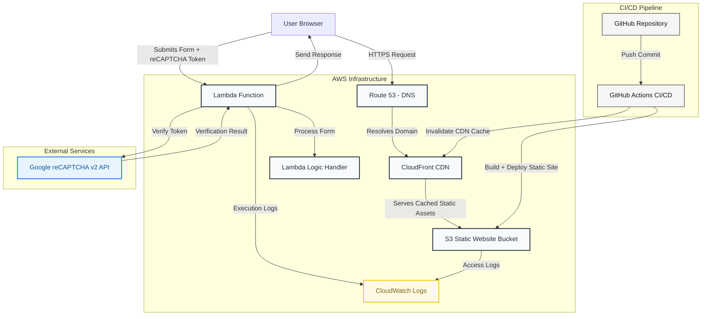

# Personal Portfolio Website

A fully automated, serverless portfolio website built to showcase my projects, cloud architecture skills, and DevOps automation practices.

Deployed on **AWS S3** with **Route53**, **CloudFront**, and **GitHub Actions CI/CD** , integrating a **Lambda contact form API** for secure messaging and cost-efficient scalability.

---

## Overview

This project demonstrates:

- **Serverless Architecture** with AWS
- **CI/CD automation** via GitHub Actions
- **Secure API Gateway + Lambda Integration**
- **Front-end optimization** for performance and reliability

---

## Architecture

## Tech Stack

### Languages:

- HTML
- CSS
- JavaScript
- Python

### AWS Services:

- S3
- Lambda
- API Gateway
- SNS - CloudFront
- Route53

### GCP Services

- Google Recaptcha v2

### DevOps Tools:

- GitHub Actions
- AWS CLI
- Boto3

## CI/CD Pipeline (GitHub Actions)

Automated deployments are triggered on each push to main with two events, quality checks and deployment.

**Quality Checks (Linting and Formatting):**

- ESLint for JavaScript (`src/**/*.js`)
- HTMLHint/htmllint for HTML (`src/**/*.html`)
- Prettier for consistent formatting across JS, HTML, CSS, JSON, and Markdown

**Build & Deployment:**

- `dist/` folder is generated from `src/`
- Uses `rimraf` to clean previous builds
- `cpx` to copy files from `src/` to `dist/`
- Deployment to AWS S3 and Cloudfront invalidation.

## Serverless Contact Form (Lambda + API Gateway)

The contact form on this site securely collects visitor messages and sends them to my AWS SNS topic via an AWS Lambda backend. It uses Google reCAPTCHA v2 to prevent spam and automated submissions, with environment variables managing secret keys for security. Form data is sent as JSON, validated server-side, and errors are gracefully handled with friendly fallback messages.

## Security and Cost Optimization

- IAM Roles instead of long-term credentials

- CORS configured for specific origins

- CAPTCHA validation before API invocation

- Minimal Lambda runtime for reduced cold start cost

- CloudFront caching to lower S3 data transfer

- Google recaptcha for lower costs (free for 10 thousand requests per month)

## About Me

I’m a DevOps & Cloud Engineer passionate about automation, scalable architectures, and developer experience.
This portfolio website is both a showcase of my work and a practical demonstration of modern cloud engineering.
